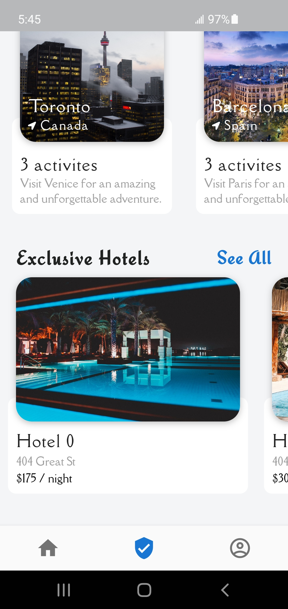

# wanderlust

A simple, native flutter application UI designed and developed for travelling. A user can explore various options for travelling arounf the world and can filter the destination acoording to their needs. Cupertino widgets are also used for better user interface. The user can also check and search for different hotels and places all around the world.

Technology Used:

Programming Language: Dart
UI Design: Google Material Design for Android
Tool: Microsoft Visual Studio Code

## Getting Started

For help getting started with Flutter, view our
[online documentation](https://flutter.dev/docs), which offers tutorials,
samples, guidance on mobile development, and a full API reference.

Screenshots (Android Device):

Home Screen

Food Item Screen

